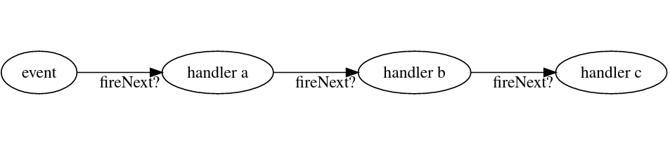

# 消息, 事件

`事件` 是 dash 里最重要的概念.  
简单的说, 当发生了一件事情(比如: 接收到消息)的时候, 就会有一个新的事件(比如: 接收到消息事件)产生, 随后这个事件会在 `EventBus` 内流动, 传递给用户的监听器(`IEventListener`)

```java
public class Example {
    @Inject
    private AbstractBot bot;
    @Test
    public void example(){
        bot.getChannel()
                .subscribeAlways((pipeline,event)->{
                    // do something securely
                    pipeline.fireNext();
                });
    }
}
```

> **Note**  
> 编写业务逻辑时，请不要漏了 `pipeline.fireNext()`, 此方法将事件传递下去。  
> 或者使用 [EventHandlerAdapter](https://github.com/kalculos/dash/blob/main/docs/dev/concept/Event_And_Message.md#%E5%8F%AA%E7%9B%91%E5%90%AC%E6%B6%88%E6%81%AF)

## 订阅事件

有两种方式可以订阅事件, 一种是通过 `IEventChannel`(事件管道), 而另一种是直接和 `IEventBus` 打交道.

直接和 bus 打交道:
```java
public class Example {
    @Inject
    private IEventBus bus;
    private AbstractBot bot;
    @Test
    public void example(){
        bus.register(Bot.getDash().getGlobalChannel(), (pipeline, event)->{
            // do something securely...
            pipeline.fireNext(); // 把事件传播下去
        });
    }
}
```

你会发现, 即使是直接使用 `IEventBus`, `IEventChannel` 还是形影不离.  
其实, `IEventChannel` 的本质是一个 *处理事件的 UnaryOperator*. 在新的事件来临之前, 你注册时用的 `IEventChannel` 会提前将事件处理一遍, 然后才交给你.  
而对于不需要处理的情况, 只需要传入 dash 的全局频道即可: `dash.getGlobalChannel()`

## 只监听消息

一般来说，每个事件处理器都要手动调用 `fireNext` 将事件传下去，但是我只是想监听事件，不做动作，有什么办法简化呢？  
当然有。那就是使用 dash 提供的 `EventHandlerAdapter`.

```java
class SimpleListener extends EventHandlerAdapter<GroupChannelMessage>{
        @Override
        public void handleMessage(GroupChannelMessage event) {
            event.reply("hello");
        }
    }
```

这同时也适用于下一节 `使用注解注册`

### 使用注解注册

除了使用流式 API 注册，你也可以用注解标注的方式注册。
```java
public class Example implements EventListener {
    @EventHandler
    public void onMessage(IEventPipeline<GroupChannelMessage> pipeline, GroupChannelMessage message){
        if(message.containString("hello")){
            message.reply("world!");
        }
        pipeline.fireNext();
    }
}
```

随后只需要调用 `IEventRegistry#registerListeners` 即可完成注册。  
更具体一些，你的监听器需要满足以下需求：

1. 类需要实现用作标记的 `EventListener` 接口，监听器方法不可以是静态的 (`static`)
2. 方法需要用 `@EventHandler` 标注，同时第一个参数必须是 `IEventPipeline` 或其子类，第二个参数必须是 `AbstractEvent` 的子类。  
  如果你用不到 pipeline 提供的 `channel()` 你也可以直接用 `IEventPipeline<?>` 作为第一个参数类型。
3. 如果你像 [只监听消息] 一节中提到的只想监听事件，那么请确保方法参数只有一个，并且是 `AbstractEvent` 或其子类。
4. 如果你接受了 pipeline, 别忘了 `fireNext`, 否则事件到此为止。

此外，`@EventHandler` 还可以配置参数:

```java
    @EventHandler(
            ignoreCancelled = true,
            priority = EventPriorities.EARLIEST,
            scheduleType = ScheduleType.ASYNC,
            name = "message handler"
    )
```

参数的内容和 `IEventChannel` 的参数没有太大区别。需要注意，此类监听器注册时使用的是 bot 的 channel.  
另外，对于 `AbstractMessage`，我们特地实现了泛型支持。

```java
public class Example implements EventListener {
    @EventHandler
    public void onMessage(IEventPipeline<?> pipeline, CompoundMessage<ChatChannel> message){
        if(message.containString("hello")){
            message.reply("world!");
        }
        pipeline.fireNext();
    }
}
```

此处 `CompoundMessage` 是 `AbstractMessage` 的子类型。当没有提供泛型参数时（或者是用 `?`），将不会对发送者类型做检查。

### 和 EventChannel 打交道

使用 `IEventChannel` 订阅:
```java
public class Example {
    @Inject
    private AbstractBot bot;
    @Test
    public void example(){
        bot.getChannel()
                .filter(it -> it instanceof GroupMessage)
                .map(it -> (GroupMessage) it)
                .subscribeAlways((pipeline,message)->{
                    // do something securely
                    pipeline.fireNext(); // don't forget to do this!
                });
    }
}
```

此处的代码和第一处有所不同.   
如上文所述, `IEventChannel` 是事件的预处理器, 因此在你的监听器(比如 `subscribeAlways`的参数)收到之前, 它会做一系列的处理, 可能丢弃, 也可能对事件做一些修改.  
而在这段代码中, 
```patch
    bot.getChannel()
+       .filter(it -> it instanceof GroupMessage)
+       .map(it -> (GroupMessage) it)
        .subscribeAlways((pipeline,message)->{
```

这两行的作用分别是:
1. `filter` 它的参数是一个条件. 不符合条件的事件将不会被最终的 `handler` 或者下一步的动作收到
2. `map` 它的参数是一个 `Function<Old,New>`, 所有符合上一步条件的事件都会在这里被处理成新的对象.

是不是很简单?

除此之外, 你还可以继续添加条件:

```java
public class Example {
    @Inject
    private AbstractBot bot;

    @Test
    public void example() {
        bot.getChannel()
                .filterForType(GroupChannelMessage.class) // filter + map
                .subscribeAlways((pipeline,event) -> {
                    event.reply("Hello!");
                    pipeline.fireNext();
                })
                .filter(it -> it.containString("hello!"))
                .subscribeAlways((pipeline,event) -> {
                    event.reply("World!");
                    pipeline.fireNext();
                });
    }
}
```

这段代码实际运行时, 会对所有 `GroupChannelMessage` 回复 `Hello!`, 随后如果该 `信息` 包含 `hello!` 的话, 还会额外回复 `World!`.

关于更多: [IEventChannel](https://github.com/kalculos/dash/blob/main/dash-core-api/src/main/java/io/ib67/dash/event/IEventChannel.java)

### 事件类型

事件大体上分两种, 一种是 `事件`, 一种是`消息`

事件(`AbstractEvent`)通常是在 dash 的 `IEventChannel` 里被传输的最基本的类型. 例如: `DashStartEvent`.  
而消息([AbstractMessage](https://github.com/kalculos/dash/blob/main/dash-core-api/src/main/java/io/ib67/dash/message/AbstractMessage.java))虽然也是事件, 但是它有以下特点:
1. *它是平台相关的* 每一个消息必然来自某个平台.  
2. *构成* 消息由三个部分构成:  
  - **消息源([IMessageSource](https://github.com/kalculos/dash/blob/main/dash-core-api/src/main/java/io/ib67/dash/message/IMessageSource.java))** -- 谁发送的消息?  
    得到了消息源, 你还可以往消息源里面发回消息.  
  - **上下文([AbstractMessage.Context](https://github.com/kalculos/dash/blob/511c221074bc5ebec548b00a2b6b8bf20dede55e/dash-core-api/src/main/java/io/ib67/dash/message/AbstractMessage.java#L59))** -- 上游(处理器,适配器)给你提供的附加信息
  - **内容** 虽然 `AbstractMessage` 没有定义内容的字段, 但是消息一般来说带有某种内容.  
    实际上事件一般也有, 但是这里要强调一下, 因为消息本身就是承载平台信息的事件

消息有很多, 最常见的就是组合消息 -- [CompoundMessage](https://github.com/kalculos/dash/blob/main/dash-core-api/src/main/java/io/ib67/dash/message/feature/CompoundMessage.java).  
组合消息是以消息链([MessageChain](https://github.com/kalculos/dash/blob/main/dash-core-api/src/main/java/io/ib67/dash/message/MessageChain.java))为*内容*的消息, 也就是你在聊天软件上看到的消息. 无论是群聊来的, 私聊来的, 只要是能带图带文带...的消息都是组合消息.  
更具体一点, 来自 `群聊频道` 的是 [GroupChannelMessage](https://github.com/kalculos/dash/blob/main/dash-core-api/src/main/java/io/ib67/dash/message/group/GroupChannelMessage.java), 他实际上就是 `CompoundMessage<ChatChannel>`  

具体的消息类型, 请参考 [消息](messages/Messages.md)
而具体的事件类型, 请参考 [事件](messages/Events.md)

### 消息链
在创建消息之前, 你很可能需要先创建一条消息链.

> **Note**
> 此处 `消息链` 所指的 `消息` 并不是事件类型的消息

在大多数聊天平台上, 我们可以发送混合的内容 -- 比如说, 图+文, 多个图一个文, 多个文穿插多个图 ... 或者只有文字和图片.
在 dash 中, 我们将单个图片或者被其他内容分隔开的文字片段称为 `消息组件`([IMessageComponent](https://github.com/kalculos/dash/blob/main/dash-core-api/src/main/java/io/ib67/dash/message/feature/IMessageComponent.java)), 把它们拼在一起也就是一条 `消息链`([MessageChain](https://github.com/kalculos/dash/blob/main/dash-core-api/src/main/java/io/ib67/dash/message/MessageChain.java)).

消息链可以由 [猫码](../../spec/CatCode.md) 转换而来:
```java
MessageChain.fromCatCode("haha! [dash:IMAGE,path=nc%3A%2F%2Fsb]");
```

...也可以自己构造
```java
        MessageChain.of(
                new Text("haha! "),
                Image.builder()
                        .path("nc://sb").build()
        );
```

 需要注意的是, 聊天组件有的可以使用 `Builder` 构造, 而有的只能用构造器.  
关于具体支持的聊天组件情况, 请参考 [猫码](../../spec/CatCode.md)

## 发布事件 & 调度流程

发布事件相当简单, 只需要调用 `IEventBus#postEvent` 即可.

```java
public class Example {
    @Inject
    private AbstractBot bot;

    @Test
    public void example() {
        bot.getChannel().getBus().postEvent(new GroupChannelMessage(..), evt->{
            // ...
        });
    }
}
```

注意: `evt` 即为你发布的事件, 事件处理器可能对其进行了修改, 这个回调不一定在当前线程运行.  
发布事件很简单, 但是我们还需要知道他的调度流程.

### [ScheduleType](https://github.com/kalculos/dash/blob/main/dash-core-api/src/main/java/io/ib67/dash/event/ScheduleType.java) / 调度类型

这是 `EventChannel` 的属性, 其决定了 *其对应 EventHandler 处理器运行的线程*.
例如:

 - 当 `scheduleType == MONITOR` 时, 处理器将在 **发布者的同一条线程上** 运行.
 - 当 `scheduleType == MAIN` 时, 处理器将在 **主线程** 上运行.  
 - 当 `scheduleType == ASYNC` 时, 处理器将在 **某一条虚拟线程** 上运行.

正确的选择可以带来性能提升, 默认的, 事件处理器总是使用 `scheduleType == MAIN`. 一方面是出于保持同步, 一方面是为了减少不确定性.  

> **WARNING**  
> 请务必不要在 `MONITOR` 或 `MAIN` 上运行堵塞代码, **你已经被警告过了**

### [EventPriorities](https://github.com/kalculos/dash/blob/main/dash-core-api/src/main/java/io/ib67/dash/event/EventPriorities.java) / 事件优先级

很遗憾, 这一小节的主角并不是 `EventPriorites` 本身, 而是 `IEventChannel` 的属性 -- `priority`.

`priority` 决定了处理器触发的先后顺序. 默认的 priority 为 `50`, 越小的 priority 越先触发. 选择 priority 时, **请尽量根据需求使用 `EventPriorities` 里面的常量.**  
此外, `scheduleType` 也参与先后顺序, 分别是: `MONITOR` -> `MAIN` -> `ASYNC`

**注意: 在 `scheduleType` 为 `ASYNC` 时, 这一功能无法保障先后顺序.**

### [IEventPipeline]() / 事件管道



当一个事件被广播时，他首先会进入主线程上的 handler 链表挨个传递。每个 handler 都可以决定 `是否传递下去`, `是否标记(cancelled)`, `是否要取消订阅` 并且 `加入新的 handler`。
借助 IEventPipeline, 你可以更加自由的控制事件的调度流程，但需要遵循一些规则：

1. 总是使用 `IEventPipeline` 提供的 `channel()` 注册新的 handler，否则会出现不可预料的错误。
2. pipeline 是不线程安全的。如果你把 pipeline 丢到目前线程之外（除非你是 `ASYNC`）可能会出现意料之外的结果
3. handlers 并不是立即注册的，它们在事件传播完毕后统一进行注册。

对于 `ASYNC` 的 handler，无法通过 pipeline 注册/取消 订阅。  

> **Note**  
> 此处再提醒一次，当 `IEventPipeline` 交到你手上的时候，请务必将事件传递下去。  
> 对于 `EventHandlerAdapter` 和使用只有一个参数的方法注解注册的用户可以不用担心这件事情，因为他们已经帮你做好了。  

> **WARNING**  
> 
> 虽然我们不推荐，但是你可以将 `dash.asyncHandlers.mutatePipeline` 设置为 `true` 来允许异步 handlers 取消注册他们。

## 构造 EventChannel

虽然大多数情况下对 `AbstractBot#getChannel` 或 `Dash#getGlobalChannel` 切割就可以达到目的, 但是有时候我们需要自己构造一个满足需求的 `EventChannel`.

```java
public class Example {
    @Inject
    private AbstractBot bot;

    @Test
    public void example() {
        var channelFactory = bot.getDash().getChannelFactory();
        channelFactory.forMonitor("Message Preprocessor", 1)
                .subscribeAlways((pipe, evt) -> {});
    }
}
```

`Dash` 提供了 `IEventChannelFactory`, 可以直接利用他构造一个新的 channel.

## 关于中间件

借助于 dash 的调度机制, 只需要选择 `EventPriorites` 中的 `EARLIER_THAN_NORMAL` 或者 `EARLIST` 即可.

同时，dash 中提供了许多 IPC 事件（本地过程调用，为分布式dash实例提供支持），事件的反应本质上也依赖于 IPC 事件工作。dash 负责 IPC 事件的传输，而中间件则需要负责处理这些到达实例的IPC事件。  
dash 的大部分功能都是基于 eventbus 运作的。  

例：一条消息发送时，用户使用的 api 会直接发送一条 `MessagePreSendEvent` 到事件总线中，随后经过总线不同优先级的 handler，最后到达作为中间件的 adapter（监听在 `LATEST`) 对该事件作出反应（发送到平台）  
发送后，adapter 将会发布一个 `MessagePostSendEvent` 到事件总线中以供其他处理器使用。  

